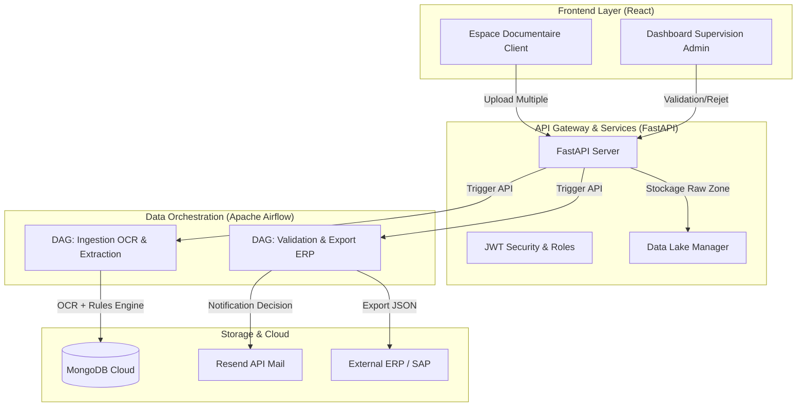

# 🛡️ Filemina - Plateforme de Supervision DocSafe AI

> **Hackathon IPSSI - 2026**
> Filemina est une solution de pointe pour la gestion, l'extraction de données par IA et l'automatisation des flux comptables.

---

## 🏗️ Architecture du Système

Filemina repose sur une architecture moderne de **Data Engineering** et de **Micro-services événementiels**.



---

## 🚀 Fonctionnalités Clés

### 👨‍💻 Espace Client (React)
- **Multi-Upload Intelligent** : Envoi groupé de documents en un seul clic.
- **Preview en direct** : Visualisation sécurisée des PDFs et images envoyés.
- **Statut IA** : Suivi du cycle de vie du document (En attente, Vérifié, Refusé).

### 👮‍♂️ Espace Administration (React)
- **Supervision OCR** : Interface de contrôle pour valider les extractions de l'Intelligence Artificielle.
- **Gestion des Utilisateurs** : Création et gestion des accès clients.
- **Dashboard Data** : Monitoring du volume documentaire en temps réel.

### ⚙️ Engine (Back-end & Data)
- **FastAPI** : API haute performance avec documentation Swagger intégrée.
- **IA OCR Integration** : Extraction automatique des montants HT/TTC et SIRET (Moteur SilverExtractor).
- **Moteur de Règles** : Vérification de cohérence comptable (HT + TVA = TTC etc).

### 🤖 Orchestration (Apache Airflow)
- **Event-Driven Pipelines** : Les DAGs ne tournent pas dans le vide, ils sont déclenchés par les actions réelles des utilisateurs via API.
- **Fault Tolerance** : Reprise sur erreur intégrée pour les exports critiques vers les ERP (ex: SAP).

---

## 🛠️ Installation & Lancement

### 1. Cloner le projet
```bash
git clone Satyaminguez/Hackathon-IPSSI
```

### 2. Lancer le Backend (Python)
```bash
cd back_end
pip install -r requirements.txt
uvicorn main:app --reload --port 8000
```

### 3. Lancer les Frontends (React)
Dans deux terminaux séparés :
```bash
# Espace Client
cd frontend/client
npm install
npm run dev

# Espace Admin
cd frontend/admin
npm install
npm run dev
```

### 4. Lancer l'Orchestrateur (Docker)
```bash
cd airflow
docker compose up -d
```
Accès Airflow : `http://localhost:8081` (admin / admin)

---

## 📧 Notifications
Le système utilise **Resend API** pour envoyer des e-mails automatiques de certification aux clients avec le nom réel du document certifié.

---

**Réalisé pour le projet annuel IPSSI par Abondance Kazadi.** 🎬🏆
